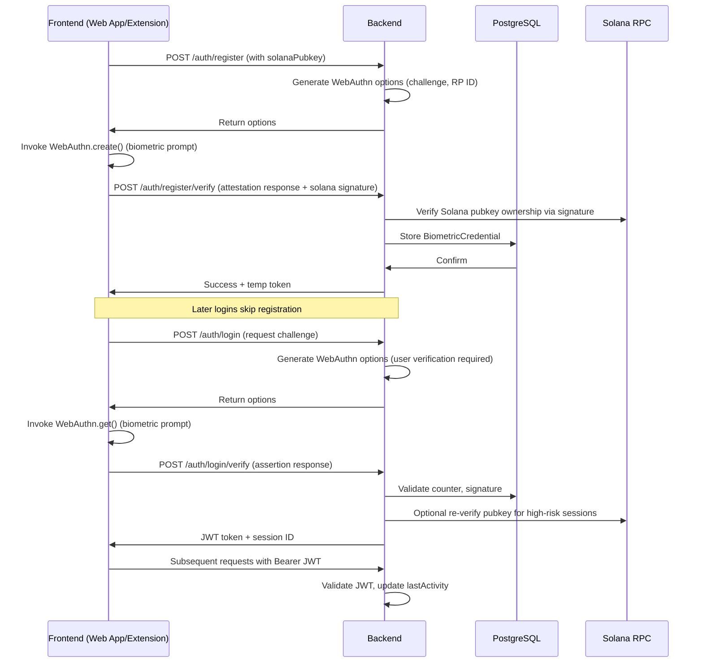

# Authentication Implementation

## Overview

The authentication system for the Secure Solana Wallet backend is designed to provide secure, biometric-based user verification while integrating seamlessly with Solana blockchain operations. Given the project's focus on user safety (e.g., biometric login via WebAuthn for fingerprint, FaceID/Face Unlock, TouchID, and Windows Hello), the backend handles challenge-response flows for biometric authentication, manages user sessions, and enforces secure access to wallet features like Safe Mode transaction flagging and phishing prevention.

This system prioritizes client-side key management for Solana wallet private keys (stored encrypted in the browser extension or web app using secure enclaves), with the backend acting as a trusted authority for session tokens and user metadata. No private keys are ever stored or transmitted to the backend, aligning with Solana's decentralized ethos. Authentication ties directly into project requirements: it gates access to Safe Mode (e.g., behavioral analytics require authenticated sessions), supports SPL token/NFT operations, and integrates with external threat databases for phishing checks during login flows.

The implementation uses Node.js with Express for the API layer, PostgreSQL with Prisma ORM for user/session storage, and JWT for stateless session management. WebAuthn is verified server-side using libraries like `@simplewebauthn/server`. All endpoints are secured with rate limiting (via `express-rate-limit`) and CORS configured for the web app/browser extension origins.

**Unique Project Identifier:** 1763624900465_secure_solana_wallet_with_biometric_login_and_advanced_safe_mode__backend_auth_md_vsfw8

## Key Components

### 1. User Model and Database Schema

Users are registered via a backend-managed account linked to a Solana public key (derived from the client-side wallet). Biometric credentials are registered client-side but attested server-side. Sessions track login state for features like transaction simulation previews and DeFi protocol interactions.

#### Prisma Schema (prisma/schema.prisma excerpt)

```prisma
model User {
  id        String   @id @default(cuid())
  email     String?  @unique // Optional for email fallback auth
  solanaPubkey String @unique // Solana wallet public key for ownership verification
  createdAt DateTime @default(now())
  updatedAt DateTime @updatedAt
  isActive  Boolean  @default(true)
  safeModeEnabled Boolean @default(true) // Ties into Safe Mode feature
  behaviorProfile Json? // Anonymized behavioral data for deviation detection (e.g., transaction patterns)

  sessions Session[]
  biometricCredentials BiometricCredential[]
}

model BiometricCredential {
  id             String @id @default(cuid())
  userId         String
  credentialId   String @unique // Base64-encoded WebAuthn credential ID
  publicKey      Bytes  // COSE public key from WebAuthn attestation
  counter        BigInt // Signature counter to prevent replay attacks
  transports     Json?  // Supported transports (e.g., ['usb', 'nfc', 'internal'])
  user           User   @relation(fields: [userId], references: [id], onDelete: Cascade)
  createdAt      DateTime @default(now())

  @@unique([userId, credentialId])
}

model Session {
  id           String   @id @default(cuid())
  userId       String
  token        String   @unique // JWT token hash for revocation
  expiresAt    DateTime
  ipAddress    String?
  userAgent    String?
  lastActivity DateTime @default(now())
  isRevoked    Boolean  @default(false)

  user User @relation(fields: [userId], references: [id], onDelete: Cascade)

  @@index([token])
  @@index([expiresAt])
}
```

- **Rationale**: The `solanaPubkey` links auth to wallet ownership without storing secrets. `behaviorProfile` stores hashed, anonymized data (e.g., transaction frequency/amount averages) for Safe Mode's deviation flagging. Migrations: Run `npx prisma migrate dev --name init-auth` after schema updates.

### 2. Biometric Authentication Flow

The flow uses WebAuthn for cross-platform biometrics, with backend verification to prevent phishing (e.g., by validating origin during challenge issuance). This supports the project's phishing prevention via URL/domain validation—challenges are only issued to whitelisted domains (web app or extension).

#### High-Level Flow Diagram (Mermaid)



- **Registration**: One-time setup links biometric to Solana pubkey. Client signs a nonce with the wallet to prove ownership.
- **Login**: Requires user verification (e.g., FaceID prompt). Successful assertion yields a JWT with claims like `sub` (user ID), `solanaPubkey`, `safeModeEnabled`, and `exp` (15-min sliding expiry, refreshable).
- **Logout/Revocation**: POST /auth/logout revokes session; all devices can be logged out via /auth/logout-all.
- **Fallback**: If biometrics fail (e.g., device lockout), optional email OTP via Twilio, but biometrics are primary per requirements.

#### Security Enhancements
- **Phishing Prevention**: Challenges include `origin` validation against allowed domains (e.g., `https://wallet.secure-solana.app`). Integrate with external databases (e.g., PhishTank API) to block suspicious referrers during auth.
- **Rate Limiting**: 5 attempts/hour per IP for challenges to thwart brute-force.
- **Solana Integration**: During login, optionally simulate a zero-value transaction to verify pubkey control without risking funds.

### 3. API Endpoints

All endpoints under `/api/v1/auth`. Use Express Router with middleware for auth guards.

#### Express Route Implementation (src/routes/auth.ts excerpt)

```typescript
import express from 'express';
import { generateRegistrationOptions, verifyRegistrationResponse } from '@simplewebauthn/server';
import { generateAuthenticationOptions, verifyAuthenticationResponse } from '@simplewebauthn/server';
import jwt from 'jsonwebtoken';
import { PrismaClient } from '@prisma/client';
import crypto from 'crypto';
import { Connection, PublicKey, Transaction } from '@solana/web3.js'; // For pubkey verification

const router = express.Router();
const prisma = new PrismaClient();
const JWT_SECRET = process.env.JWT_SECRET!; // 256-bit key from env
const SOLANA_RPC = process.env.SOLANA_RPC_URL!; // e.g., https://api.mainnet-beta.solana.com
const solanaConnection = new Connection(SOLANA_RPC);

const RP_ID = process.env.WEBAUTHN_RP_ID || 'secure-solana.app'; // Matches project domain
const EXPECTED_ORIGIN = process.env.WEBAUTHN_ORIGIN || 'https://secure-solana.app';

// Middleware: Verify JWT (except for public auth endpoints)
const authenticateToken = (req: express.Request, res: express.Response, next: express.NextFunction) => {
  const authHeader = req.headers['authorization'];
  const token = authHeader && authHeader.split(' ')[1];
  if (!token) return res.status(401).json({ error: 'Access token required' });

  jwt.verify(token, JWT_SECRET, (err, user) => {
    if (err) return res.status(403).json({ error: 'Invalid token' });
    (req as any).user = user;
    next();
  });
};

// POST /api/v1/auth/register
router.post('/register', async (req, res) => {
  const { solanaPubkey: pubkeyStr, origin } = req.body;
  if (origin !== EXPECTED_ORIGIN) return res.status(400).json({ error: 'Invalid origin' });

  try {
    const pubkey = new PublicKey(pubkeyStr);
    // Verify pubkey ownership: Client should provide signature of challenge nonce
    const { nonce, signature } = req.body; // Client-signed nonce
    const message = new TextEncoder().encode(nonce);
    // In production, use solanaConnection.verifySignature() or ed25519 verify

    const options = generateRegistrationOptions({
      rpName: 'Secure Solana Wallet',
      rpID: RP_ID,
      userID: pubkey.toBytes(), // Use pubkey bytes as user ID
      userName: pubkeyStr,
      attestationType: 'indirect',
      authenticatorSelection: { userVerification: 'required', authenticatorAttachment: 'platform' }, // Prioritize biometrics
    });

    // Store challenge in temp cache (Redis) with TTL 5min
    // req.app.locals.challenges.set(options.challenge, { userId: null, pubkey: pubkeyStr });

    // Create or update User
    let user = await prisma.user.upsert({
      where: { solanaPubkey: pubkeyStr },
      update: {},
      create: { solanaPubkey: pubkeyStr, safeModeEnabled: true },
    });

    res.json({ ...options, userId: user.id });
  } catch (error) {
    res.status(500).json({ error: 'Registration failed' });
  }
});

// POST /api/v1/auth/register/verify
router.post('/register/verify', async (req, res) => {
  const { response, expectedChallenge, solanaPubkey } = req.body;
  const cachedChallenge = /* fetch from cache */;
  if (expectedChallenge !== cachedChallenge?.challenge) return res.status(400).json({ error: 'Invalid challenge' });

  try {
    const user = await prisma.user.findUnique({ where: { solanaPubkey } });
    if (!user) return res.status(404).json({ error: 'User not found' });

    const verification = await verifyRegistrationResponse({
      response,
      expectedChallenge,
      expectedOrigin: EXPECTED_ORIGIN,
      expectedRPID: RP_ID,
      authenticator: { /* from response */ },
    });

    if (verification.verified) {
      await prisma.biometricCredential.create({
        data: {
          userId: user.id,
          credentialId: response.id,
          publicKey: Buffer.from(verification.registrationInfo!.credentialPublicKey, 'base64'),
          counter: verification.registrationInfo!.counter,
          transports: response.transports,
        },
      });

      // Issue temp JWT for post-registration setup
      const tempToken = jwt.sign({ sub: user.id, solanaPubkey, type: 'temp' }, JWT_SECRET, { expiresIn: '1h' });
      res.json({ success: true, token: tempToken });
    } else {
      res.status(400).json({ error: 'Verification failed' });
    }
  } catch (error) {
    res.status(500).json({ error: 'Verification error' });
  }
});

// POST /api/v1/auth/login
router.post('/login', async (req, res) => {
  const { solanaPubkey } = req.body;
  const user = await prisma.user.findUnique({ where: { solanaPubkey } });
  if (!user || !user.isActive) return res.status(404).json({ error: 'User not found or inactive' });

  const options = generateAuthenticationOptions({
    rpID: RP_ID,
    challenge: crypto.randomBytes(32).toString('base64url'),
    allowCredentials: await prisma.biometricCredential.findMany({
      where: { userId: user.id },
      select: { id: true, transports: true },
    }).then(creds => creds.map(c => ({ id: Buffer.from(c.id, 'base64'), transports: c.transports }))),
    userVerification: 'required',
  });

  // Cache challenge
  // req.app.locals.challenges.set(options.challenge, { userId: user.id });

  res.json(options);
});

// POST /api/v1/auth/login/verify
router.post('/login/verify', async (req, res) => {
  const { response, solanaPubkey } = req.body;
  const cached = /* fetch challenge */;
  const user = await prisma.user.findUnique({ where: { solanaPubkey } });
  if (!user) return res.status(404).json({ error: 'User not found' });

  try {
    const dbCredential = await prisma.biometricCredential.findFirst({
      where: { userId: user.id, credentialId: response.id },
    });

    const verification = await verifyAuthenticationResponse({
      response,
      expectedChallenge: cached.challenge,
      expectedOrigin: EXPECTED_ORIGIN,
      expectedRPID: RP_ID,
      authenticator: dbCredential!,
    });

    if (verification.verified && verification.counter > dbCredential!.counter) {
      await prisma.biometricCredential.update({
        where: { id: dbCredential.id },
        data: { counter: verification.counter },
      });

      // Check against phishing DB (e.g., integrate PhishTank)
      // const isPhished = await checkPhishingOrigin(req.headers.origin);
      // if (isPhished) return res.status(403).json({ error: 'Suspicious origin' });

      // Update behavior profile if needed for Safe Mode
      if (user.behaviorProfile) {
        // Anonymized update, e.g., increment login count
        await prisma.user.update({
          where: { id: user.id },
          data: { behaviorProfile: { ...user.behaviorProfile, loginCount: (user.behaviorProfile.loginCount || 0) + 1 } },
        });
      }

      const token = jwt.sign(
        { sub: user.id, solanaPubkey, safeModeEnabled: user.safeModeEnabled },
        JWT_SECRET,
        { expiresIn: '15m' }
      );

      await prisma.session.create({
        data: {
          userId: user.id,
          token: crypto.createHash('sha256').update(token).digest('hex'),
          expiresAt: new Date(Date.now() + 15 * 60 * 1000),
          ipAddress: req.ip,
          userAgent: req.get('User-Agent'),
        },
      });

      res.json({ token, user: { id: user.id, solanaPubkey, safeModeEnabled: user.safeModeEnabled } });
    } else {
      res.status(400).json({ error: 'Authentication failed' });
    }
  } catch (error) {
    res.status(500).json({ error: 'Login verification error' });
  }
});

// POST /api/v1/auth/refresh (authenticated)
router.post('/refresh', authenticateToken, async (req, res) => {
  const userId = (req as any).user.sub;
  const user = await prisma.user.findUnique({ where: { id: userId } });
  if (!user) return res.status(404).json({ error: 'User not found' });

  // Revoke old session, issue new
  await prisma.session.updateMany({
    where: { userId, isRevoked: false },
    data: { isRevoked: true },
  });

  const newToken = jwt.sign(
    { sub: user.id, solanaPubkey: user.solanaPubkey, safeModeEnabled: user.safeModeEnabled },
    JWT_SECRET,
    { expiresIn: '15m' }
  );

  await prisma.session.create({
    data: {
      userId: user.id,
      token: crypto.createHash('sha256').update(newToken).digest('hex'),
      expiresAt: new Date(Date.now() + 15 * 60 * 1000),
      ipAddress: req.ip,
      userAgent: req.get('User-Agent'),
    },
  });

  res.json({ token: newToken });
});

// POST /api/v1/auth/logout (authenticated)
router.post('/logout', authenticateToken, async (req, res) => {
  const tokenHash = crypto.createHash('sha256').update(req.headers.authorization!.split(' ')[1]).digest('hex');
  await prisma.session.updateMany({
    where: { token: tokenHash },
    data: { isRevoked: true },
  });
  res.json({ success: true });
});

// GET /api/v1/auth/sessions (authenticated) - List active sessions for Safe Mode auditing
router.get('/sessions', authenticateToken, async (req, res) => {
  const userId = (req as any).user.sub;
  const sessions = await prisma.session.findMany({
    where: { userId, isRevoked: false, expiresAt: { gt: new Date() } },
    select: { id: true, ipAddress: true, lastActivity: true, createdAt: true },
    orderBy: { lastActivity: 'desc' },
  });
  res.json(sessions);
});

export default router;
```

- **API Contract for FrontendDev**: 
  - All responses use JSON with `error` field for failures.
  - JWT claims: `sub` (user ID), `solanaPubkey`, `safeModeEnabled` (boolean for Safe Mode toggles).
  - Errors: Standard HTTP codes (400 for client errors, 401/403 for auth, 500 for server).
  - Headers: `Authorization: Bearer <token>`, `Origin` required for WebAuthn.
  - Rate Limit: Applied via middleware, e.g., 10 req/min for login.

- **Integration with Other Features**:
  - **Safe Mode**: Auth tokens include `safeModeEnabled`; protected endpoints (e.g., /transactions/flag) require it. Behavioral deviations (e.g., unusual login IP) trigger warnings.
  - **Phishing Prevention**: Pre-login, validate against external APIs; post-login, session includes threat score.
  - **Hardware Wallet**: For Ledger/YubiKey, extend WebAuthn with `authenticatorAttachment: 'cross-platform'`.
  - **Solana Ops**: Use token to authorize RPC proxies (e.g., simulateTransaction with user pubkey).

### 4. Security Considerations

- **Key Management**: JWTs use HS256; rotate secrets quarterly. Sessions revocable for compromised devices.
- **Compliance**: WebAuthn ensures FIDO2 Level 2; audit logs for all auth events (store in separate table).
- **Edge Cases**: Handle biometric unavailability (e.g., return to hardware wallet signing). For mobile browsers, test FaceID via Safari/Chrome.
- **Testing**: Unit tests with Jest for verification flows; e2e with Cypress simulating biometrics (mock WebAuthn). Load test: 1000 concurrent logins.
- **Deployment**: Dockerize with `EXPOSE 3000`; AWS Fargate for scaling. Env vars: `JWT_SECRET`, `WEBAUTHN_RP_ID`, `SOLANA_RPC_URL`.
- **Monitoring**: Integrate Sentry for errors; Prometheus for auth metrics (e.g., login success rate).

This auth system uniquely enables the project's biometric-first approach, ensuring secure access to advanced features like transaction decoding and NFT metadata fetching while maintaining Solana's non-custodial principles. For updates, coordinate with FrontendDev on WebAuthn option payloads and ProductManager on user flow tweaks.